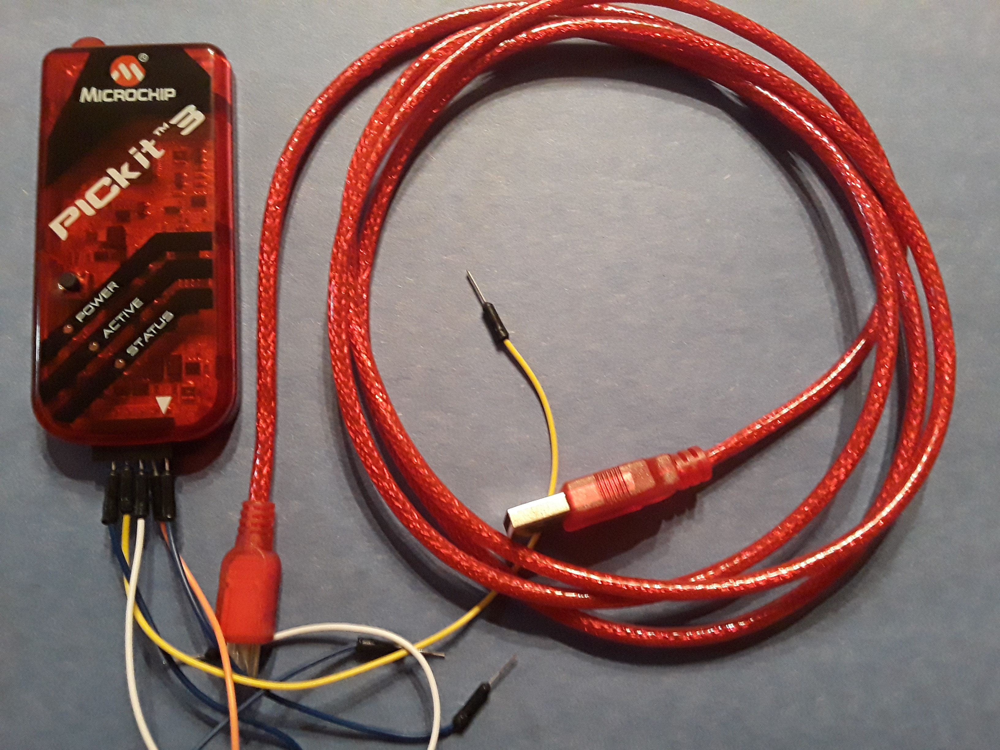

# PIC16F84A_Microcontroller

## Project Outline

 The scope of this project is learning how to setup embedded systems.  This entails hardware selection, setup, 
 circuit configuration, and coding of a microcontroller.  Microchip's 8 bit PIC16F84A is the standalone microcontroller 
 chip for this project.  Various references will be used for each exercise in this project.  I will post a readmefile 
 for each exercise containing media, schematics, and any special notes.  Each directory contains the project build files 
 created by Microchip's IDE.  Just use the source code if you are using a different microcontroller.
 
### Code

 The microcontroller will be coded in Assembly, and C. Some exercises will be coded in C while containing sections of 
 assembly for performance purposes.
 
### In-Circuit Programmer/Debugger
 The PICkit 3 In-Circuit Programmer/Debugger is used to upload the machine code to PIC microcontrollers.  Microchip provides a 
 product info page at the following link: [PICkit3 product info page](http://www.microchip.com/Developmenttools/ProductDetails.aspx?PartNO=PG164130) .
 PICkit 3 image below: 
 
### Microchip PIC16F84A
 [PIC16F84A product info page](http://www.microchip.com/wwwproducts/en/pic16f84a)\n
 [PIC16F84A data sheet](http://ww1.microchip.com/downloads/en/DeviceDoc/35007C.pdf) 
 
 PIC16F84A Pin Diagram:
 
 
